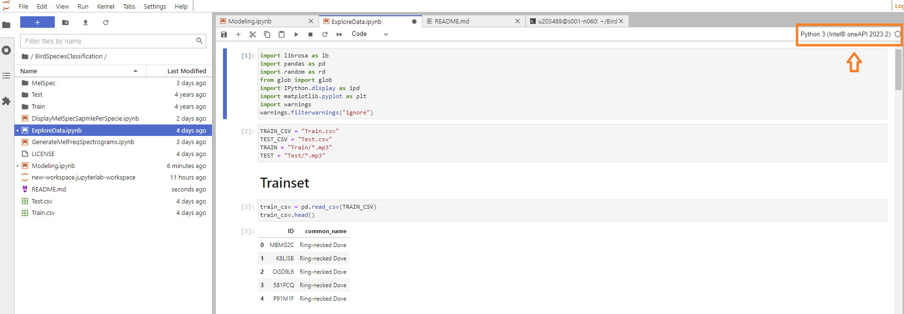
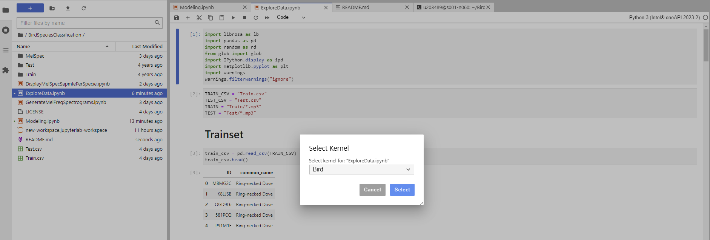

# BirdSpeciesClassification
A deep learning project for bird specie classification based on OneAPI-Tensorflow.

The data can be found at https://zindi.africa/competitions/fowl-escapades/data \
We have 40 bird species and a total number of 1856 records.

## Environment setup
1- Connect to Intel DevCloud with your account. 

2- Open terminal and clone the repo: git clone https://github.com/Sinda271/BirdSpeciesClassification.git 

3- Navigate to the project folder: cd BirdSpeciesClassification 

4- Download data: \
&emsp;    a- Train data: wget https://api.zindi.africa/v1/competitions/fowl-escapades/files/Train.zip?auth_token=zus.v1.ZxSp1yg.mvM6YjEkRqZPea7uf9xjH8SNH93Rfh \
&emsp;    b- Unzip train data: unzip -FF 'Train.zip?auth_token=zus.v1.ZxSp1yg.mvM6YjEkRqZPea7uf9xjH8SNH93Rfh' \
&emsp;    c- Test data: wget https://api.zindi.africa/v1/competitions/fowl-escapades/files/Test.zip?auth_token=zus.v1.ZxSp1yg.mvM6YjEkRqZPea7uf9xjH8SNH93Rfh \
&emsp;    d- Unzip test data: unzip -FF 'Test.zip?auth_token=zus.v1.ZxSp1yg.mvM6YjEkRqZPea7uf9xjH8SNH93Rfh' \
&emsp;    e- Remove zip files 
    
5- Setup conda environment: \
&emsp;    a- Create a conda env from Intel's tensorflow-gpu env: conda create -n bird --clone tensorflow-gpu \
&emsp;    b- Activate env: conda activate bird \
&emsp;    c- Install librosa library for signal processing: conda install -c conda-forge librosa \
&emsp;    d- Register env as a jupyter kernel: pip install ipkernel ; python -m ipykernel install --user --name=bird \
&emsp;    e- In all the jupyter notebooks choose the new kernel to before running them \
      \
     
    
6- Run the notebooks in the following order: \
&emsp;    a- ExploreData.ipynb \
&emsp;    b- GenerateMelFrequencySpectrograms.ipynb \
&emsp;    c- DisplayMelSpecSamplePerSpecie.ipynb \
&emsp;    d- Modeling.ipynb 
    
